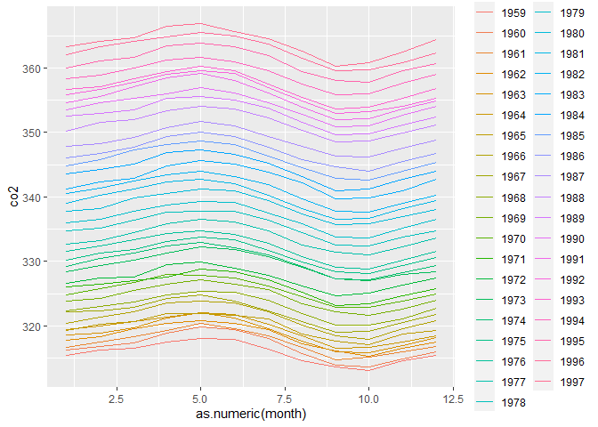

reshape\_Data
================
Sadia Boksh
19/11/2020

``` r
library(tidyverse)
```

    ## -- Attaching packages ------------------------------------------------------------- tidyverse 1.3.0 --

    ## v ggplot2 3.3.2     v purrr   0.3.4
    ## v tibble  3.0.3     v dplyr   1.0.0
    ## v tidyr   1.1.0     v stringr 1.4.0
    ## v readr   1.3.1     v forcats 0.5.0

    ## -- Conflicts ---------------------------------------------------------------- tidyverse_conflicts() --
    ## x dplyr::filter() masks stats::filter()
    ## x dplyr::lag()    masks stats::lag()

``` r
library(dslabs)
library(rmarkdown)
```

    ## Warning: package 'rmarkdown' was built under R version 4.0.3

``` r
data("co2")
```

# Reshape Data

Change wide data to tidy data by gathering.

``` r
 co2_wide <- data.frame(matrix(co2, ncol = 12, byrow = TRUE)) %>% 
      setNames(1:12) %>%
    mutate(year = as.character(1959:1997))
co2_tidy <- gather(co2_wide,month,co2,-year)
```

# Plots

``` r
co2_tidy %>% ggplot(aes(as.numeric(month), co2, color = year)) + geom_line()
```

<!-- -->
